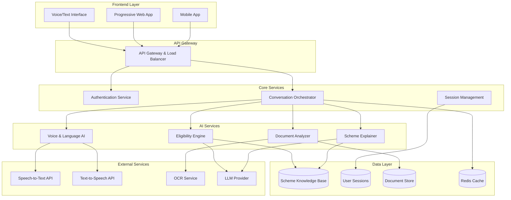

# Design Document: AI-Powered Scheme Eligibility & Document Assistant

## Overview

The AI-powered Scheme Eligibility & Document Assistant is designed as a modular, scalable system that democratizes access to government schemes for Indian citizens. The system employs a hybrid AI architecture combining rule-based reasoning with large language models to provide explainable, trustworthy guidance on scheme eligibility, document requirements, and application processes.

The architecture prioritizes voice-first interaction, multilingual support, and low-bandwidth optimization to serve diverse user populations including rural farmers, elderly citizens, and urban low-income workers. The system acts as a digital seva mitra, bridging the gap between complex government processes and citizen needs through conversational AI.

## Architecture

The system follows a layered microservices architecture designed for scalability, maintainability, and offline capability:



### Key Architectural Decisions

1. **Hybrid AI Approach**: Combines rule-based eligibility checking with LLM-powered explanation and conversation
2. **Microservices Design**: Enables independent scaling and deployment of AI components
3. **Progressive Web App**: Provides offline capability and cross-platform compatibility
4. **Caching Strategy**: Redis-based caching for scheme data and conversation context
5. **API-First Design**: Enables future integrations with government systems and third-party services

## Components and Interfaces

### Frontend Components

#### Voice/Text Interface
- **Purpose**: Primary user interaction layer supporting both voice and text input
- **Key Features**: 
  - Real-time speech recognition with Hindi/Hinglish support
  - Conversational UI with chat-like experience
  - Accessibility features for screen readers
  - Offline mode for cached conversations
- **Interface**: RESTful API with WebSocket support for real-time interaction

#### Progressive Web App (PWA)
- **Purpose**: Cross-platform application with offline capabilities
- **Key Features**:
  - Service worker for offline functionality
  - Responsive design for mobile and desktop
  - Push notifications for scheme deadlines
  - Local storage for user preferences
- **Interface**: Standard web technologies with PWA manifest

### Core Service Components

#### Conversation Orchestrator
- **Purpose**: Central coordinator managing conversation flow and service integration
- **Key Features**:
  - Context management across conversation turns
  - Service routing based on user intent
  - Session state persistence
  - Error handling and fallback mechanisms
- **Interface**: 
  ```
  POST /api/v1/conversation
  {
    "message": "string",
    "sessionId": "string",
    "language": "string",
    "inputType": "voice|text"
  }
  ```

#### Authentication Service
- **Purpose**: Lightweight authentication without storing sensitive personal data
- **Key Features**:
  - Anonymous session management
  - Optional phone number verification
  - Session-based authentication tokens
  - Privacy-first design
- **Interface**: JWT-based authentication with session tokens

### AI Service Components

#### Eligibility Reasoning Engine
- **Purpose**: Determines scheme eligibility using hybrid rule-based and AI reasoning
- **Key Features**:
  - Rule engine for structured eligibility criteria
  - LLM integration for complex scenario analysis
  - Explainable decision making
  - Multi-scheme evaluation and stacking
- **Interface**:
  ```
  POST /api/v1/eligibility/check
  {
    "userProfile": {
      "age": "number",
      "income": "number",
      "location": "string",
      "category": "string",
      "lifeEvents": ["string"]
    },
    "schemes": ["string"]
  }
  ```

#### Government Scheme Explainer
- **Purpose**: Converts complex government documents into simplified, actionable information
- **Key Features**:
  - PDF processing and text extraction
  - RAG-based scheme information retrieval
  - Multi-language explanation generation
  - Structured scheme metadata extraction
- **Interface**:
  ```
  POST /api/v1/schemes/explain
  {
    "schemeId": "string",
    "language": "string",
    "complexity": "simple|detailed"
  }
  ```

#### Document Understanding Module
- **Purpose**: Analyzes user documents and identifies gaps in application requirements
- **Key Features**:
  - OCR for document text extraction
  - Entity recognition for document classification
  - Gap analysis against scheme requirements
  - Document authenticity basic checks
- **Interface**:
  ```
  POST /api/v1/documents/analyze
  {
    "documents": ["base64_encoded_images"],
    "schemeId": "string",
    "userLocation": "string"
  }
  ```

#### Voice & Language Processing Layer
- **Purpose**: Handles multilingual voice interaction and natural language understanding
- **Key Features**:
  - Speech-to-text with Hindi/Hinglish support
  - Text-to-speech with natural voice synthesis
  - Language detection and switching
  - Intent recognition and entity extraction
- **Interface**:
  ```
  POST /api/v1/voice/process
  {
    "audioData": "base64_encoded_audio",
    "language": "string",
    "operation": "stt|tts"
  }
  ```

## Data Models

### Core Data Structures

#### User Session Model
```typescript
interface UserSession {
  sessionId: string;
  createdAt: Date;
  lastActive: Date;
  language: 'hi' | 'en' | 'hinglish';
  conversationContext: ConversationContext;
  userProfile?: UserProfile;
  preferences: UserPreferences;
}

interface ConversationContext {
  currentIntent: string;
  entities: Record<string, any>;
  conversationHistory: Message[];
  activeSchemes: string[];
  documentStatus: DocumentStatus;
}

interface UserProfile {
  age?: number;
  income?: number;
  location: {
    state: string;
    district: string;
    pincode?: string;
  };
  category?: 'General' | 'OBC' | 'SC' | 'ST' | 'EWS';
  lifeEvents: LifeEvent[];
  occupation?: string;
  familySize?: number;
}

interface LifeEvent {
  type: 'pregnancy' | 'job_loss' | 'disability' | 'new_business' | 'marriage' | 'death_in_family';
  date: Date;
  details?: Record<string, any>;
}
```

#### Scheme Knowledge Model
```typescript
interface GovernmentScheme {
  schemeId: string;
  name: {
    en: string;
    hi: string;
  };
  description: {
    en: string;
    hi: string;
  };
  eligibilityCriteria: EligibilityCriteria;
  benefits: Benefit[];
  documents: DocumentRequirement[];
  applicationProcess: ApplicationStep[];
  deadlines: Deadline[];
  geographicScope: GeographicScope;
  category: SchemeCategory;
  lastUpdated: Date;
  sourceDocument: string;
}

interface EligibilityCriteria {
  age?: {
    min?: number;
    max?: number;
  };
  income?: {
    max?: number;
    type: 'annual' | 'monthly';
  };
  category?: string[];
  location?: {
    states?: string[];
    districts?: string[];
    rural?: boolean;
    urban?: boolean;
  };
  customRules: Rule[];
}

interface Rule {
  condition: string;
  operator: 'AND' | 'OR' | 'NOT';
  value: any;
  explanation: {
    en: string;
    hi: string;
  };
}
```

#### Document Model
```typescript
interface DocumentRequirement {
  documentType: string;
  name: {
    en: string;
    hi: string;
  };
  mandatory: boolean;
  alternatives?: string[];
  obtainFrom: string;
  validityPeriod?: number;
  format: 'original' | 'photocopy' | 'self_attested';
  locationSpecific: boolean;
}

interface UserDocument {
  documentId: string;
  type: string;
  status: 'uploaded' | 'verified' | 'rejected' | 'missing';
  extractedData: Record<string, any>;
  uploadedAt: Date;
  expiryDate?: Date;
  issueAuthority?: string;
}

interface DocumentGap {
  requiredDocument: string;
  status: 'missing' | 'expired' | 'invalid';
  guidance: {
    en: string;
    hi: string;
  };
  obtainFrom: string;
  estimatedTime: string;
  cost?: number;
}
```

#### Conversation Model
```typescript
interface Message {
  messageId: string;
  timestamp: Date;
  type: 'user' | 'assistant';
  content: {
    text: string;
    audio?: string;
  };
  language: string;
  intent?: string;
  entities?: Record<string, any>;
  confidence?: number;
}

interface ConversationFlow {
  flowId: string;
  currentStep: string;
  steps: FlowStep[];
  context: Record<string, any>;
  completed: boolean;
}

interface FlowStep {
  stepId: string;
  type: 'question' | 'information' | 'action' | 'decision';
  prompt: {
    en: string;
    hi: string;
  };
  expectedInput?: string;
  nextStep?: string;
  conditions?: Condition[];
}
```

### Database Schema Design

#### Scheme Knowledge Base (MongoDB)
- **Schemes Collection**: Stores structured scheme information with multilingual support
- **Rules Collection**: Stores eligibility rules with versioning
- **Documents Collection**: Stores document requirements and templates
- **Locations Collection**: Stores geographic hierarchy and location-specific rules

#### User Sessions (Redis)
- **Session Store**: Temporary storage for active user sessions
- **Conversation Cache**: Stores conversation context and history
- **User Preferences**: Caches user language and interaction preferences

#### Document Store (File System + Metadata DB)
- **File Storage**: Secure storage for uploaded documents (temporary)
- **Metadata Store**: Document metadata and processing results
- **Processing Queue**: Queue for document analysis tasks

### API Response Models

#### Eligibility Response
```typescript
interface EligibilityResponse {
  eligible: boolean;
  confidence: number;
  reasoning: {
    en: string;
    hi: string;
  };
  schemes: EligibleScheme[];
  recommendations: Recommendation[];
  nextSteps: string[];
}

interface EligibleScheme {
  schemeId: string;
  name: string;
  eligibilityScore: number;
  benefits: string[];
  applicationDeadline?: Date;
  documentGaps: DocumentGap[];
}
```

#### Explanation Response
```typescript
interface ExplanationResponse {
  schemeId: string;
  summary: {
    en: string;
    hi: string;
  };
  eligibility: {
    criteria: string[];
    explanation: string;
  };
  benefits: {
    description: string;
    amount?: number;
    duration?: string;
  };
  applicationProcess: {
    steps: string[];
    timeline: string;
    documents: string[];
  };
  deadlines: {
    application?: Date;
    document_submission?: Date;
  };
}
```

## Correctness Properties

*A property is a characteristic or behavior that should hold true across all valid executions of a system-essentially, a formal statement about what the system should do. Properties serve as the bridge between human-readable specifications and machine-verifiable correctness guarantees.*

Based on the requirements analysis, the following correctness properties ensure the system behaves correctly across all valid inputs and scenarios:

### Property 1: Eligibility Determination Consistency
*For any* user profile and scheme criteria, the eligibility determination should be consistent with the defined government rules and provide explainable reasoning that references specific criteria.
**Validates: Requirements 1.1, 1.2, 9.1**

### Property 2: Life Event Scheme Mapping
*For any* life event mentioned by a citizen, the system should suggest only schemes that are actually relevant to that specific life event type.
**Validates: Requirements 1.3**

### Property 3: Scheme Stacking Optimization
*For any* set of applicable schemes for a user, the recommended combinations should be non-conflicting and provide maximum benefit without violating scheme rules.
**Validates: Requirements 1.4**

### Property 4: Gap Analysis Completeness
*For any* ineligible scenario, the system should identify all specific eligibility gaps and provide actionable steps to address each gap.
**Validates: Requirements 1.5, 3.3**

### Property 5: Document Processing Round Trip
*For any* valid government scheme document, processing then explaining should preserve all essential information including eligibility criteria, benefits, and deadlines.
**Validates: Requirements 2.1, 2.3**

### Property 6: Multilingual Response Consistency
*For any* scheme explanation request, the response should be provided in the requested language while maintaining consistent information content across all supported languages.
**Validates: Requirements 2.4, 4.2**

### Property 7: Document Checklist Personalization
*For any* eligible user and scheme combination, the generated document checklist should be complete, personalized to the user's location, and include all mandatory requirements.
**Validates: Requirements 3.1, 3.4**

### Property 8: Document Gap Detection Accuracy
*For any* set of uploaded documents and scheme requirements, the system should correctly identify all missing or incomplete documents without false positives.
**Validates: Requirements 3.2**

### Property 9: Voice Interface Language Fidelity
*For any* voice input in Hindi or Hinglish, the speech-to-text conversion should maintain semantic meaning and the text-to-speech output should be natural and understandable.
**Validates: Requirements 4.1, 4.2**

### Property 10: Language Simplification Consistency
*For any* generated response, the language complexity should be appropriate for low-literacy users while preserving all essential information.
**Validates: Requirements 4.3**

### Property 11: Application Guidance Completeness
*For any* ready-to-apply scenario, the system should provide complete step-by-step guidance that covers all required procedures and potential rejection scenarios.
**Validates: Requirements 5.1, 5.3, 5.5**

### Property 12: Form Pre-filling Accuracy
*For any* user information and application form, the pre-filled draft should accurately map user data to the correct form fields without errors or omissions.
**Validates: Requirements 5.2**

### Property 13: Knowledge Base Data Integrity
*For any* scheme information stored in the knowledge base, the data should be structured correctly for AI processing and maintain referential integrity across updates.
**Validates: Requirements 6.1, 6.2, 6.3**

### Property 14: Location-Specific Rule Application
*For any* scheme with regional variations, the system should apply only the rules and requirements specific to the user's location.
**Validates: Requirements 6.4**

### Property 15: Data Privacy Protection
*For any* personal information collected during conversations, the data should be processed locally, encrypted in transit and storage, and completely removable upon request.
**Validates: Requirements 7.1, 7.2, 7.3, 7.4**

### Property 16: Performance Under Constraints
*For any* system load or connectivity condition, core eligibility and explanation functions should remain responsive within acceptable time limits.
**Validates: Requirements 8.1, 8.2, 8.4**

### Property 17: Accessibility Compliance
*For any* user interaction, the system should be compatible with screen readers and assistive technologies while maintaining full functionality.
**Validates: Requirements 8.3**

### Property 18: Error Recovery Guidance
*For any* error condition, the system should provide clear error messages in the user's preferred language along with specific recovery options.
**Validates: Requirements 8.5**

### Property 19: Recommendation Explainability
*For any* scheme recommendation, the system should provide clear explanations of why specific schemes were suggested based on the user's circumstances.
**Validates: Requirements 9.2**

### Property 20: Source Attribution Accuracy
*For any* document requirement or eligibility criterion, the system should reference the correct official government source and regulation.
**Validates: Requirements 9.3**

### Property 21: Uncertainty Indication
*For any* AI decision with low confidence, the system should clearly indicate uncertainty and suggest human verification.
**Validates: Requirements 9.4**

### Property 22: Authority Distinction
*For any* guidance provided, the system should clearly distinguish between AI assistance and official government authority.
**Validates: Requirements 9.5**

### Property 23: Integration Compatibility
*For any* external API integration, the system should maintain consistent user experience and data flow without disrupting existing functionality.
**Validates: Requirements 10.2, 10.5**

### Property 24: Extensibility Preservation
*For any* new language or document type addition, the system should support the extension without breaking existing functionality.
**Validates: Requirements 10.3, 10.4**

## Error Handling

The system implements comprehensive error handling across all layers to ensure graceful degradation and user-friendly error recovery:

### AI Service Error Handling

#### Eligibility Engine Errors
- **LLM Service Unavailable**: Fall back to rule-based eligibility checking with reduced explanation quality
- **Incomplete User Data**: Request specific missing information through conversational prompts
- **Conflicting Rules**: Flag conflicts for administrative review and provide best-effort guidance
- **Low Confidence Decisions**: Clearly indicate uncertainty and suggest human verification

#### Document Processing Errors
- **OCR Failures**: Request clearer document images or alternative document formats
- **Unsupported Document Types**: Provide guidance on acceptable document formats
- **Corrupted Files**: Request document re-upload with file format validation
- **Processing Timeouts**: Queue documents for batch processing and notify users of delays

#### Voice Interface Errors
- **Speech Recognition Failures**: Request clarification or offer text input alternative
- **Language Detection Errors**: Allow manual language selection and learn from corrections
- **Audio Quality Issues**: Provide guidance on improving audio input quality
- **TTS Service Failures**: Fall back to text-only responses with apology message

### System-Level Error Handling

#### Network and Connectivity
- **API Timeouts**: Implement exponential backoff with circuit breaker patterns
- **Service Unavailability**: Provide cached responses where possible and queue requests
- **Bandwidth Limitations**: Optimize response size and offer text-only modes
- **Offline Scenarios**: Enable core functionality through cached data and local processing

#### Data and Storage Errors
- **Database Connection Failures**: Implement connection pooling with automatic retry
- **Cache Misses**: Fall back to primary data sources with performance logging
- **Storage Quota Exceeded**: Implement automatic cleanup of expired sessions and documents
- **Data Corruption**: Validate data integrity and request fresh data from authoritative sources

#### Security and Privacy Errors
- **Authentication Failures**: Provide clear guidance on session renewal
- **Data Encryption Errors**: Fail securely and prevent data exposure
- **Privacy Violations**: Immediately halt processing and notify security team
- **Unauthorized Access**: Log security events and implement rate limiting

### User Experience Error Recovery

#### Conversation Flow Errors
- **Intent Recognition Failures**: Ask clarifying questions and offer menu options
- **Context Loss**: Gracefully restart conversation with summary of previous progress
- **Infinite Loops**: Implement conversation turn limits with human escalation
- **User Frustration Detection**: Offer alternative interaction modes or human assistance

#### Application Process Errors
- **Form Validation Failures**: Provide specific field-level error messages with examples
- **Document Upload Errors**: Offer multiple upload methods and format guidance
- **Deadline Misses**: Provide alternative schemes or next available application periods
- **Eligibility Changes**: Explain changes and suggest updated pathways

## Testing Strategy

The testing strategy employs a dual approach combining unit testing for specific scenarios with property-based testing for comprehensive correctness validation.

### Property-Based Testing Framework

**Framework Selection**: The system will use Hypothesis (Python) for backend services and fast-check (TypeScript) for frontend components to implement property-based testing.

**Test Configuration**:
- Minimum 100 iterations per property test to ensure statistical confidence
- Each property test references its corresponding design document property
- Tag format: **Feature: ai-scheme-assistant, Property {number}: {property_text}**
- Randomized input generation covering edge cases and boundary conditions

**Property Test Implementation**:
- **Property 1-4**: Test eligibility engine with randomized user profiles and scheme criteria
- **Property 5-6**: Test document processing and multilingual consistency with generated scheme documents
- **Property 7-8**: Test document analysis with synthetic document sets and known gaps
- **Property 9-10**: Test voice interface with generated audio samples and complexity analysis
- **Property 11-12**: Test application guidance with randomized user scenarios
- **Property 13-14**: Test knowledge base integrity with generated scheme data
- **Property 15**: Test privacy protection with synthetic personal data
- **Property 16-18**: Test performance and accessibility under simulated constraints
- **Property 19-24**: Test explainability and extensibility with generated scenarios

### Unit Testing Strategy

**Core Component Testing**:
- **Eligibility Engine**: Test specific eligibility scenarios, edge cases, and error conditions
- **Document Analyzer**: Test OCR accuracy, entity extraction, and gap detection with real documents
- **Voice Interface**: Test speech recognition accuracy with recorded samples in Hindi/Hinglish
- **Conversation Orchestrator**: Test conversation flow management and context preservation
- **Knowledge Base**: Test data ingestion, querying, and update operations

**Integration Testing**:
- **End-to-End Flows**: Test complete user journeys from eligibility check to application guidance
- **API Integration**: Test external service integrations with mock services and error scenarios
- **Cross-Language Consistency**: Test information consistency across Hindi and English responses
- **Performance Testing**: Test system behavior under load with realistic user patterns

**Accessibility Testing**:
- **Screen Reader Compatibility**: Test with NVDA, JAWS, and VoiceOver
- **Keyboard Navigation**: Verify complete functionality without mouse interaction
- **Color Contrast**: Ensure WCAG 2.1 AA compliance for visual elements
- **Voice Interface Accessibility**: Test with users having speech impairments

### Test Data Management

**Synthetic Data Generation**:
- **User Profiles**: Generate diverse demographic profiles covering all user segments
- **Scheme Documents**: Create test scheme PDFs with known structure and content
- **Audio Samples**: Generate speech samples in Hindi, English, and Hinglish
- **Document Images**: Create synthetic document images for OCR testing

**Privacy-Preserving Testing**:
- **Data Anonymization**: Use synthetic personal data that cannot be traced to real individuals
- **Secure Test Environments**: Isolate test data from production systems
- **Data Cleanup**: Automatically purge test data after test completion
- **Compliance Verification**: Regular audits to ensure test data handling meets privacy requirements

### Continuous Testing Pipeline

**Automated Testing**:
- **Pre-commit Hooks**: Run unit tests and basic property tests before code commits
- **CI/CD Pipeline**: Execute full test suite including property tests on every deployment
- **Performance Monitoring**: Continuous monitoring of response times and system metrics
- **Accessibility Scanning**: Automated accessibility testing in CI pipeline

**Manual Testing**:
- **User Acceptance Testing**: Regular testing with representative users from target demographics
- **Linguistic Testing**: Native Hindi speakers validate language quality and cultural appropriateness
- **Accessibility Testing**: Testing with users who rely on assistive technologies
- **Security Testing**: Regular penetration testing and security audits

**Monitoring and Feedback**:
- **Real-time Monitoring**: Track system performance, error rates, and user satisfaction
- **A/B Testing**: Test different conversation flows and explanation strategies
- **User Feedback Integration**: Incorporate user feedback into test scenarios and requirements
- **Continuous Improvement**: Regular review and update of test strategies based on production insights